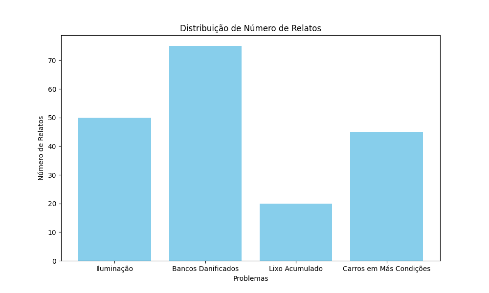
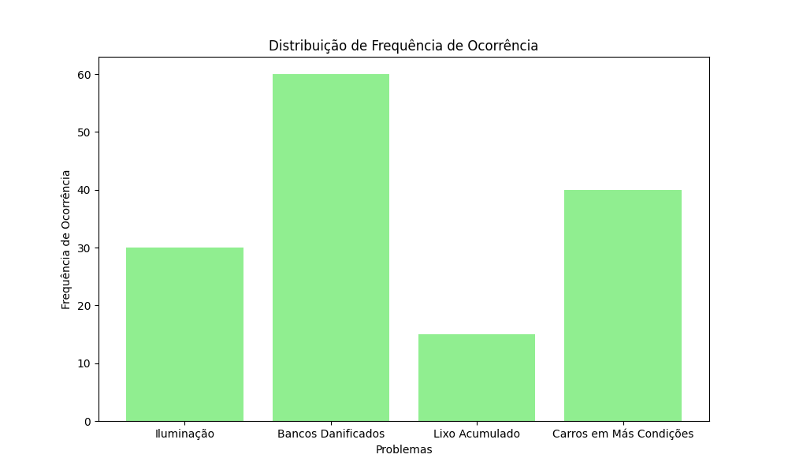
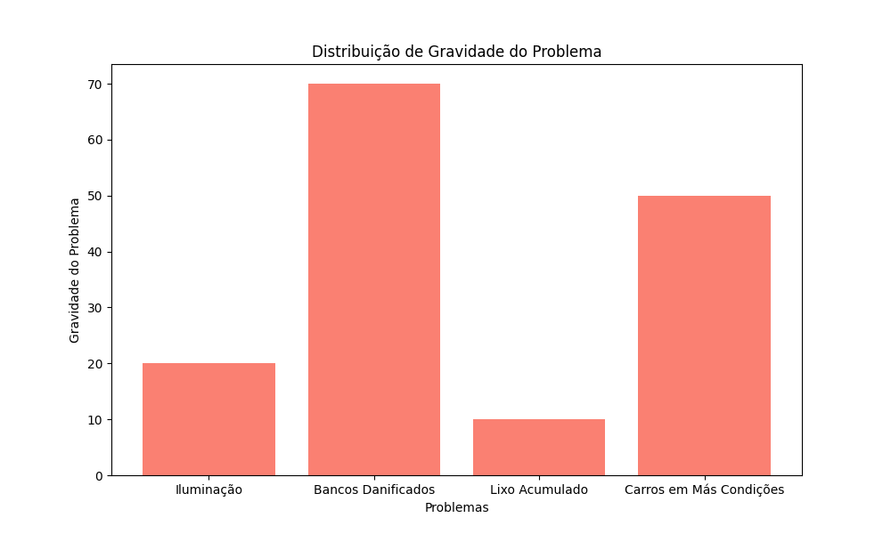
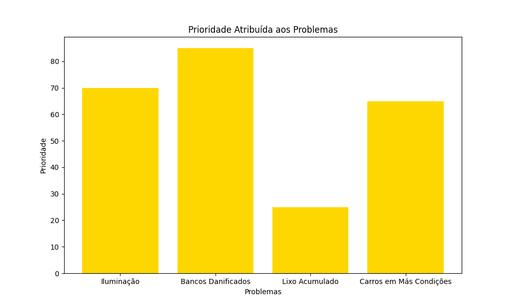

# Sistema  - Cidades Inteligentes

## Introdução

- **Problema:** Grande volume de reclamações sobre transporte público que precisam ser analisadas e categorizadas para melhorar o serviço.

- **Solução:** Utilização de técnicas de Processamento de Linguagem Natural (PLN) e Rede Neural para automatizar a análise e classificação das reclamações.

  

## Objetivos

- **Objetivo Geral:** Desenvolver um aplicativo de celular automatizado utilizando PLN para análise e classificação de reclamações do transporte público.
- **Objetivos Específicos**:
  - Gerar dados fictícios de reclamações para testes usando modelos de PLN para simular o aplicativo ainda em desenvolvimento.
  - Analisar e classificar as reclamações utilizando a API da OpenAI.
  - Categorizar as reclamações 
  - Gerar relatórios detalhados e resumos da análise.

### Funcionamento do Sistema

O sistema funcionará através de um aplicativo móvel que permite aos cidadãos relatarem problemas encontrados ao utilizar o transporte público, como falta de iluminação, bancos danificados, lixo acumulado, carros em más condições, entre outros. Os relatórios dos cidadãos serão analisados utilizando técnicas de Processamento de Linguagem Natural (PLN) para extrair informações relevantes e redes neurais para priorização das intervenções.

### Técnica de IA Utilizada

A técnica de IA utilizada neste projeto é o Processamento de Linguagem Natural (PLN), que permite analisar e compreender os relatos dos cidadãos, e redes neurais, que auxiliam na classificação e priorização dos problemas reportados. As variáveis analisadas incluem:

- **Número de Relatos:** Quantidade de vezes que um problema específico foi relatado.
- **Frequência de Ocorrência:** Com que frequência o problema ocorre.
- **Gravidade do Problema:** Impacto do problema no transporte público.

Para cada variável, foram definidos critérios de análise utilizando PLN para interpretação dos relatos e redes neurais para aprendizado e priorização baseados em dados históricos e padrões identificados nos relatos.

### Gráficos e Regras de Análise

- **Gráficos de Entrada:** Serão apresentados gráficos que mostram a distribuição das variáveis de entrada (número de relatos, frequência de ocorrência, gravidade do problema) e suas respectivas distribuições, utilizando histogramas e gráficos de barras.
- **Gráfico de Saída:** Será apresentado o gráfico de saída, que representa a prioridade atribuída a cada problema nos pontos de parada e/ou transportes, utilizando gráficos de barras ou gráficos de dispersão.
- **Regras de Análise:** As regras de análise serão apresentadas em forma de tabela, mostrando como as variáveis de entrada são combinadas para determinar a prioridade do problema. As regras são derivadas de padrões identificados pelas redes neurais e refinadas pelo modelo de PLN para garantir precisão e relevância nas intervenções propostas.

### Descrição dos Gráficos

- Gráficos de Entrada:

  - **Distribuição de Número de Relatos:** Mostra quantas vezes cada problema foi relatado.

  

  - **Distribuição de Frequência de Ocorrência:** Mostra com que frequência cada problema ocorre.

  

  - **Distribuição de Gravidade do Problema:** Mostra a gravidade atribuída a cada problema.

  

- Gráfico de Saída:

  - **Prioridade Atribuída aos Problemas:** Mostra a prioridade determinada para cada problema, baseado na análise dos dados de entrada.

  

### Regras de Análise

- **Regra 1:** Se o número de relatos for alto e a gravidade do problema for alta, então a prioridade é alta.
- **Regra 2:** Se o número de relatos for médio e a frequência de ocorrência for alta, então a prioridade é média.
- **Regra 3:** Se o número de relatos for baixo e a gravidade do problema for baixa, então a prioridade é baixa.

## Explicação técnica do projeto

Projeto utilizando API do OpenAI para gerar dados fictícios de reclamações de Usuários e aplicar PLN avançado para analisar e classificar os dados

O projeto é divido em 2  parte:

- Gerar dados fictícios
- Analisar dados, classificar  e gerar resultado

## Gerar dados fictícios

1. **Chamada da API da OpenAI:**
   - O código utiliza `openai.ChatCompletion.create` para gerar respostas fictícias baseadas no prompt fornecido.
   - O modelo `gpt-4` é chamado com um prompt que orienta o modelo a gerar dados fictícios. Este modelo é treinado para compreender e gerar texto de alta qualidade.
2. **PLN Interno:**
   - A OpenAI usa modelos de PLN que são redes neurais treinadas em grandes corpora de texto. Esses modelos podem compreender o contexto, gerar texto coerente e responder a perguntas de maneira semelhante a um humano.

Código utilizado para geração de dados : [criarDados.py]()

Saída do código: [dados_ficticios.txt]()

## Analisar dados, classificar  e gerar resultado

1. **Leitura das Reclamações:**
   - A função `ler_reclamacoes_arquivo` lê as reclamações de um arquivo de texto e as filtra com base na presença de "Resposta".
2. **Análise das Reclamações:**
   - A função `analisar_reclamacoes` faz chamadas para a API da OpenAI, que usa modelos de PLN para analisar e classificar cada reclamação.
   - A OpenAI aplica técnicas avançadas de PLN para entender o contexto e o conteúdo de cada reclamação.
3. **Classificação por Prioridade:**
   - A função `classificar_prioridade` classifica as análises em categorias de prioridade (baixa, média, alta) com base no texto da análise.
4. **Classificação por Categoria:**
   - A função `classificar_categoria` agrupa as reclamações por categoria, extraindo a categoria de cada reclamação.
5. **Salvamento dos Resultados em Markdown:**
   - As funções `salvar_resultados_markdown` e `salvar_resumo_markdown` escrevem os resultados classificados e o resumo em arquivos Markdown, garantindo que a codificação UTF-8 seja usada para suportar acentuações e caracteres especiais.

Este código utiliza a API da OpenAI para aplicar técnicas de PLN na análise e classificação das reclamações, sem a necessidade de implementar diretamente modelos de redes neurais.

Código utilizado para geração de dados : [analisarReclamacoes.py]()

Saída do código: 

[resultados_classificados.md]()

[resumo_analise.md](resumo_analise.md)

## Conclusão

- **Automatização da Análise com PLN:** Redução do tempo e esforço necessários para analisar reclamações de transporte público utilizando modelos avançados de PLN.
- **Melhoria do Serviço:** Fornecimento de insights valiosos para melhorar a qualidade do transporte público com base nas reclamações dos usuários.
- **Escalabilidade:** A metodologia pode ser aplicada a outros setores que necessitam de análise de grandes volumes de texto, demonstrando a versatilidade das técnicas de PLN.

